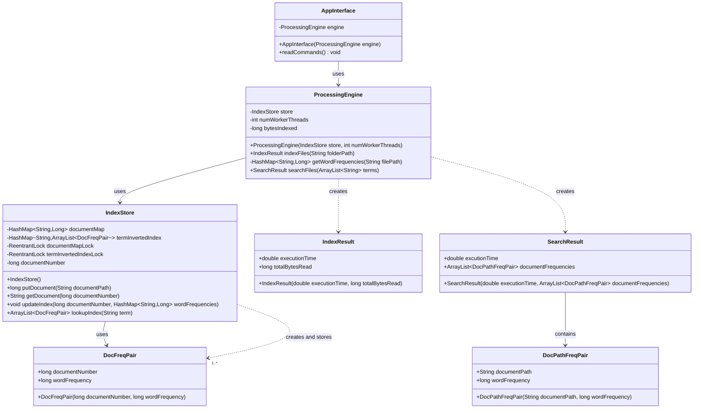

## Information Retrieval Engine with Mulithreading

### Intro

I have built a InformationRetrievalEngine system which demonstrates the implementation of two important concepts of distributed systems which are application layering and mulithreading. This Information Retrieval Engine supports indexing or traversing files from a specified input folder and also supports searching of indexed or traversed documents when a user gives a multiple term query. Upon providing search words, this application will search those words across all the traversed and read files and finally returns a list of top 10 documents contaning those search words in the order of their frequency. I have also added the support for mulithreading in this project. Mulithreading will help increase the indexing performance of my application and I have added support for 1,2,4 and 8 threads. Below is few instructions on how to run my application and also my directory structure.

### System Design

This class diagram illustrates the core architecture of the search engine system, showing the relationships between the user interface (AppInterface), processing layer (ProcessingEngine), and data storage (IndexStore) components.




### Directory structure

* After cloning this repository you will need to follow a specific directory structure to run the program.
* Enter into app-java directory: "cd app-java"
* Here, when you type "ls" you will be able to see datasets directory, java build file and src directory where my source code exists.
* You can acces my code if you want to by following the specific path: "cd src/main/java/csc435/app"
* After entering into the above path, type "ls" and you will find my source code files. If you wish to enter any source code file type "vi filename.java".

Next is how to run my application:-


#### How to run application


### Java solution
#### How to build/compile

To build the Java solution use the following commands:
To build this application you will need to be present in "app-java" directory where you will be able to see the build file, datasets directory and src directory.
```
cd app-java
mvn compile
mvn package
```

#### How to run application

To run the Java solution (after you build the project) use the following command:

Please do run the application 12 times by selecting the number of threads 1,2,4 and 8 respectively for each dataset.

If you encounter an exception during runtime and the program stops abruptly, then you can retry running the application with either same number of threads or different and the program will be working fine.
```
java -cp target/app-java-1.0-SNAPSHOT.jar csc435.app.FileRetrievalEngine <number of worker threads>
```

#### Example

```
java -cp target/app-java-1.0-SNAPSHOT.jar csc435.app.FileRetrievalEngine 4
> index ../datasets/dataset1
Completed indexing 134321105 bytes of data with 4 worker threads
Completed indexing in 5.386 seconds
> search at
Search completed in 0.4 seconds
Search results (top 10 out of 0):
> search Worms
Search completed in 2.8 seconds
Search results (top 10 out of 12):
* folder4/Document10553.txt:4
* folder3/Document1043.txt:4
* folder7/Document1091.txt:3
* folder3/Document10383.txt:3
* folder7/folderB/Document10991.txt:2
* folder8/Document11116.txt:1
* folder5/folderB/Document10706.txt:1
* folder5/folderB/Document10705.txt:1
* folder5/folderA/Document10689.txt:1
* folder4/Document1051.txt:1
> search distortion AND adaptation
Search completed in 3.27 seconds
Search results (top 10 out of 4):
* folder7/folderC/Document10998.txt:6
* folder4/Document10516.txt:3
* folder8/Document11159.txt:2
* folder8/Document11157.txt:2
> quit
```
